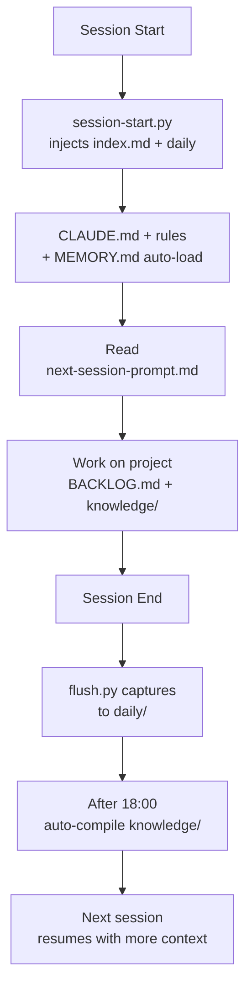

# Claude Memory Kit

**The OS layer for Claude Code. Not just memory — the entire context management lifecycle.**

[](LICENSE)
[](https://docs.anthropic.com/en/docs/claude-code/overview)
[](https://www.python.org/)
[](https://github.com/awrshift/claude-memory-kit/stargazers)

## The Problem

Every new Claude chat forgets everything. Project structure, last week's decisions, yesterday's bug fix — gone. You spend the first 10 minutes of every session re-explaining context Claude already had, then lost.

**Claude Memory Kit is an OS layer that fixes this in a 5-minute setup — zero API cost, runs on your existing Claude subscription.**

## Quick Start

```bash
git clone https://github.com/awrshift/claude-memory-kit.git my-project
cd my-project
claude
```

Claude handles the rest — it asks your name, project name, and preferred language, then sets everything up.

> [!TIP]
> After setup, type `/tour` — Claude walks you through the system using your actual project files.

## What's New in v3

- **SessionStart injection** — `index.md` + recent daily logs auto-injected into every session (Karpathy/Cole pattern)
- **End-of-day auto-compile** — `flush.py` transparently spawns `compile.py` after 18:00 local if today's daily log has new content
- **`/memory-compile`, `/memory-lint`, `/memory-query`** slash commands
- **BACKLOG.md** replaces JOURNAL.md — task queue and chronological log are distinct files (`BACKLOG.md` + `daily/YYYY-MM-DD.md`)
- **Knowledge wiki simplified** — 3 subdirs (concepts/connections/meetings) instead of 6
- **CLAUDE_INVOKED_BY** recursion guard now documented as a feature in CLAUDE.md

See [CHANGELOG.md](CHANGELOG.md) for migration notes from v2.

## What You Get

Five layers, one system. Install once — use across all your projects.

| Layer | File | What it does |
|-------|------|-------------|
| **Brain** | `CLAUDE.md` | Agent identity, behavior rules, workflow |
| **Memory** | `.claude/memory/` | Hot cache (MEMORY.md) + wiki (knowledge/) |
| **Rules** | `.claude/rules/` | Domain-specific behavior (auto-loaded) |
| **Backlog** | `projects/X/BACKLOG.md` | Per-project task queue, decisions, status |
| **Context hub** | `context/next-session-prompt.md` | "Pick up here" between sessions |

Everything is plain Markdown. No database. No external services. If you mess up, `git checkout` or run `python3 .claude/memory/scripts/lint.py --fix`.

## How It Works

Three layers load at different times. Light context on every session, heavy context only when needed.



### Loading tiers

| Tier | What | When |
|------|------|------|
| L1 Auto | CLAUDE.md + rules + MEMORY.md + SessionStart injection (index + recent daily + top concepts) | Every session |
| L2 Start | next-session-prompt.md | Session start (explicit read) |
| L3 Project | BACKLOG.md | When working on a project |
| L4 Wiki | knowledge/*.md | On-demand (deep queries beyond injected subset) |
| L5 Daily | daily/YYYY-MM-DD.md | Raw source, auto-captured |

## Installation

### Requirements

- [Claude Code](https://docs.anthropic.com/en/docs/claude-code/overview) CLI installed
- Claude Pro/Max subscription OR API credits
- Python 3.9+ (for memory pipeline scripts, optional)

### macOS / Linux

```bash
git clone https://github.com/awrshift/claude-memory-kit.git my-project
cd my-project
claude
```

<details>
<summary>Install on Windows (WSL2)</summary>

Same commands as macOS/Linux, run inside WSL2:

```bash
git clone https://github.com/awrshift/claude-memory-kit.git my-project
cd my-project
claude
```

Native PowerShell is untested — WSL2 recommended for hook compatibility.

</details>

## Usage

### Talk to Claude

| What you say | What happens |
|-------------|-------------|
| `/tour` | Interactive guided walkthrough using your actual files |
| `/memory-compile` | Manually compile daily/ logs into knowledge/ articles |
| `/memory-lint` | Run 6 structural health checks on the knowledge base |
| `/memory-query "question"` | Ask the knowledge base a natural-language question |
| "Let's work on [project]" | Agent reads that project's BACKLOG.md and resumes |
| "Save context" or "Update context" | Agent saves patterns to memory, updates session prompt |
| "Create an experiment about [question]" | Agent creates sandbox folder for structured research |
| "What do you remember about [topic]?" | Agent reads MEMORY.md index + relevant wiki articles |

### Safety nets (automatic)

- Before context compression → agent blocked until it saves (brief pause)
- Every ~50 exchanges → agent checkpoints progress (brief pause)
- Session end → background process captures conversation to `daily/YYYY-MM-DD.md`
- Editing existing test files → blocked unless creating a new test

## FAQ

<details>
<summary>Do I need to know how to code?</summary>

No. After setup, you talk to Claude in plain language. "Read the marketing plan and draft three emails" works just as well as technical commands.

</details>

<details>
<summary>Is my data private?</summary>

Yes. Everything stays on your computer. Claude Code talks to Anthropic's API, which does not train on your data by default.

</details>

<details>
<summary>How much does it cost?</summary>

The kit is free and open source. Claude Code needs a Claude Max/Pro subscription or Anthropic API credits. No extra cost for the memory pipeline — it uses your existing subscription.

</details>

<details>
<summary>Can I use this with an existing project?</summary>

Yes. During setup, choose "I have existing code" and point Claude to your codebase. It will analyze the structure and set up context around it.

</details>

<details>
<summary>What happens if I mess up the memory files?</summary>

Everything is plain text in git. Three recovery options:
1. Roll back: `git checkout .claude/memory/`
2. Lint + auto-fix: `python3 .claude/memory/scripts/lint.py --fix` (6 structural checks, auto-adds missing backlinks)
3. Rebuild: delete the wiki and run `python3 .claude/memory/scripts/compile.py --all` to regenerate from `daily/YYYY-MM-DD.md` history

</details>

<details>
<summary>Do I need Obsidian?</summary>

No. The `knowledge/` wiki is plain Markdown with `[[wikilinks]]`. You can read and edit it in VS Code, any Markdown editor, or GitHub web view. Obsidian is only needed if you want the visual graph view.

</details>

## Contributing

Issues and PRs welcome. See [CONTRIBUTING.md](CONTRIBUTING.md) for guidelines.

## License

MIT — see [LICENSE](LICENSE).
