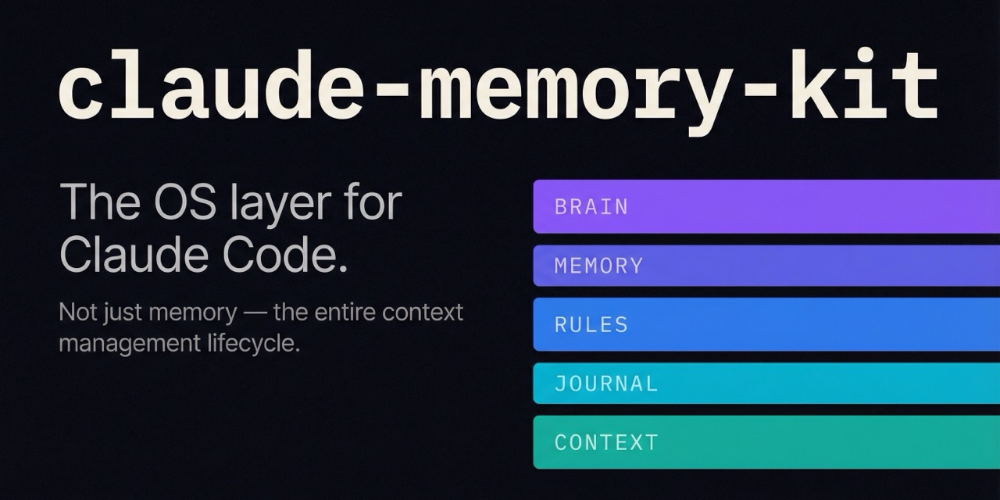
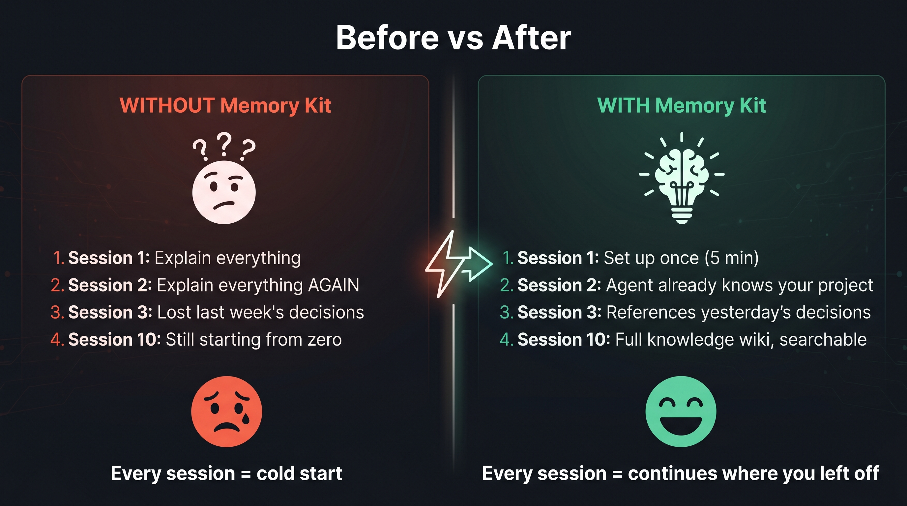
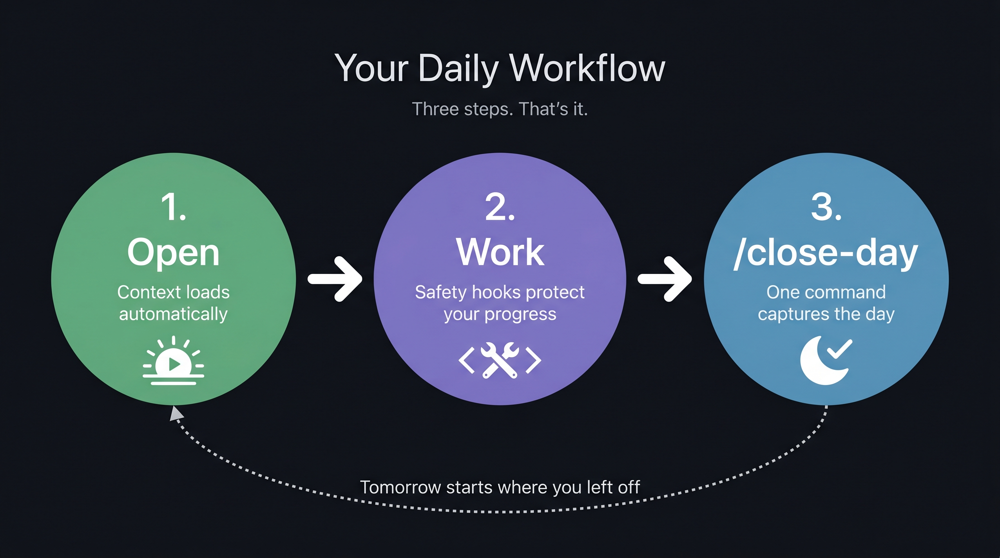
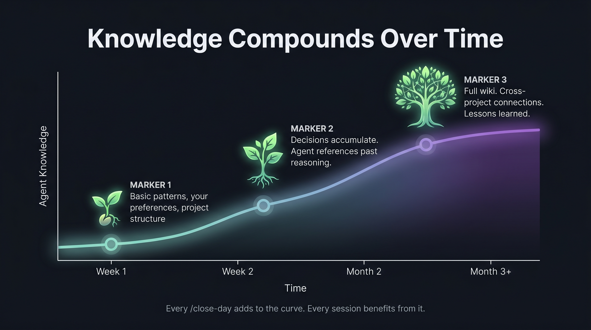

# Claude Memory Kit

**Your Claude agent remembers everything. Across sessions. Across projects. Zero setup.**

[](https://github.com/awrshift/claude-memory-kit/releases)
[](LICENSE)
[](https://docs.anthropic.com/en/docs/claude-code/overview)
[](https://github.com/awrshift/claude-memory-kit/stargazers)

## The Problem

Every new Claude session starts from zero. Yesterday's decisions, last week's research, the bug you fixed three days ago — gone. You waste the first 10 minutes re-explaining what Claude already knew.

**Claude Memory Kit fixes this in 3 commands. No API cost. Runs on your existing subscription.**

## Get Started

```bash
git clone https://github.com/awrshift/claude-memory-kit.git my-project
cd my-project
claude
```

That's it. Claude sets everything up and asks a few questions (your name, project name, language).

> [!TIP]
> Type `/tour` after setup — Claude walks you through the system using your actual files.

---

## Before and After



| | Without Memory Kit | With Memory Kit |
|---|---|---|
| **New session** | Starts from zero. "What project is this?" | Knows your project, last session, current tasks |
| **After 10 sessions** | Nothing accumulated | Searchable wiki of decisions, patterns, lessons |
| **Multiple projects** | Total chaos | Each project has its own context, automatically |
| **Context compression** | Silently loses everything | Hook blocks Claude until it saves first |
| **Next day** | "Remind me what we did yesterday" | Agent already knows — injected at session start |

---

## Your Daily Workflow



Three steps. That's your entire workflow:

### 1. Open a session
Claude automatically loads your context — project state, recent decisions, knowledge wiki. You don't do anything.

### 2. Work normally
Talk to Claude. Build features. Fix bugs. Research. Safety hooks run invisibly in the background — they checkpoint your progress every ~50 exchanges and before context compression.

### 3. Close the day
When you're done, type `/close-day`. Claude scans everything you changed today and writes a daily summary. Takes 30 seconds.

**That's it.** Tomorrow's session starts exactly where you left off.

---

## Knowledge Compounds Over Time



Every `/close-day` feeds into a growing knowledge base:

- **Day 1–7:** Basic patterns, project structure, your preferences
- **Week 2–4:** Decisions accumulate. Agent starts referencing past reasoning
- **Month 2+:** Full wiki of concepts, cross-project connections, lessons learned

Run `/memory-compile` periodically to structure daily logs into searchable wiki articles. Or don't — the daily logs alone give you 80% of the value.

---

## What You Get

| What | How it helps |
|------|-------------|
| **Persistent memory** | Patterns and decisions survive between sessions |
| **Multi-project support** | Each project has its own backlog and context |
| **Session handoff** | `next-session-prompt.md` — "pick up exactly here" |
| **Knowledge wiki** | Structured articles with search, built from your daily work |
| **Safety hooks** | Agent can't lose context during compression or long sessions |
| **Commands** | `/memory-compile`, `/memory-lint`, `/memory-query` (in `.claude/commands/`) |
| **Skills** | `/close-day`, `/tour` (in `.claude/skills/`) |

Everything is plain Markdown files. No database. No external services. `git checkout` recovers anything.

---

## FAQ

<details>
<summary><b>Do I need to know how to code?</b></summary>

No. You talk to Claude in plain language. "Read the marketing plan and draft three emails" works perfectly.

</details>

<details>
<summary><b>How much does it cost?</b></summary>

The kit is free and open source. You need a Claude Pro or Max subscription (which you probably already have). No extra API cost.

</details>

<details>
<summary><b>Is my data private?</b></summary>

Yes. Everything stays on your computer in plain text files.

</details>

<details>
<summary><b>Can I use this with an existing project?</b></summary>

Yes. During setup, tell Claude you have existing code. It analyzes the structure and sets up context around it.

</details>

<details>
<summary><b>What if I forget to run /close-day?</b></summary>

Nothing bad happens. Your in-session saves (patterns, tasks, handoff notes) are already captured by safety hooks. `/close-day` adds a richer daily summary on top — nice to have, not critical.

</details>

<details>
<summary><b>What happens if I mess up the memory files?</b></summary>

Everything is in git. `git checkout .claude/memory/` rolls back instantly. Or run `/memory-lint` to auto-fix structural issues.

</details>

---

## Project Structure

```
SKILL.md              ← Skill entry point (for aggregators)
CLAUDE.md             ← Agent brain
README.md             ← You are here
ARCHITECTURE.md       ← Full technical details
skills/               ← Aggregator-facing skill index (symlinks into .claude/skills/)
├── close-day/SKILL.md → ../../.claude/skills/close-day/SKILL.md
└── tour/SKILL.md     → ../../.claude/skills/tour/SKILL.md
knowledge/            ← Wiki articles (grows over time)
projects/             ← Per-project backlogs
context/              ← Session handoff
daily/                ← Daily summaries
.claude/
├── memory/MEMORY.md  ← Hot cache (~200 lines)
├── memory/scripts/   ← Pipeline: compile, lint, query, flush, config
├── hooks/            ← 5 hooks (context injection + safety nets)
├── rules/            ← Domain conventions (see _example.md.disabled)
├── commands/         ← Slash commands (/memory-compile, /memory-lint, /memory-query)
└── skills/           ← Skills runtime source (/close-day, /tour)
```

Runtime reads skills from `.claude/skills/`. The root `skills/` directory exists for Claude Code skill aggregators that scan repository roots — kept in sync via symlinks so edits to one reflect in the other.

## How It Works (for the curious)

You interact with 3 things: your project files, slash commands, and Claude. Everything else is automatic.

Under the hood: a `session-start.py` hook injects your knowledge wiki index at startup. Safety hooks checkpoint progress automatically. `/close-day` synthesizes daily articles. `/memory-compile` transforms them into structured wiki entries.

**Full architecture details:** [ARCHITECTURE.md](ARCHITECTURE.md)

---

## Provenance

Built on ideas from [Andrej Karpathy](https://karpathy.ai/) (LLM knowledge base patterns) and [Cole Medin](https://github.com/coleam00)'s `claude-memory-compiler`. Simplified for daily CLI use — auto-flush replaced with deliberate `/close-day` synthesis after real-world testing showed ~50% failure rate in background automation.

700+ real sessions across 7 projects. This is what survived.

## Contributing

Issues and PRs welcome. See [CONTRIBUTING.md](CONTRIBUTING.md).

## License

MIT — see [LICENSE](LICENSE).
