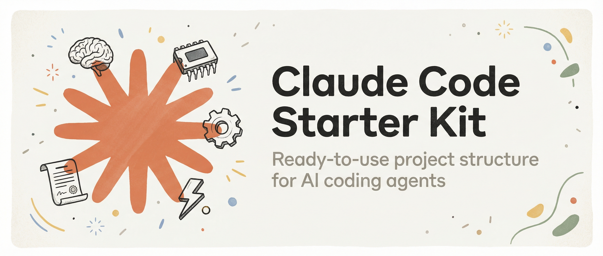
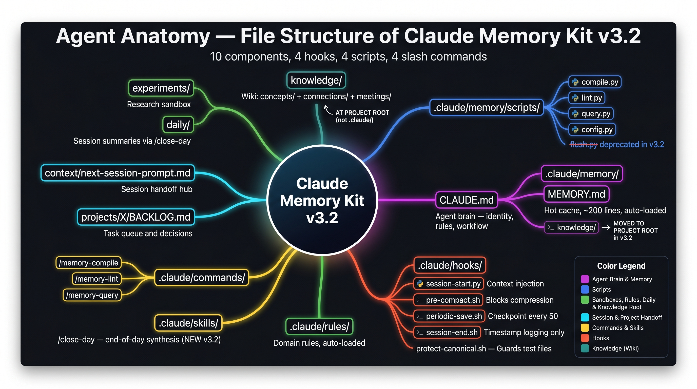
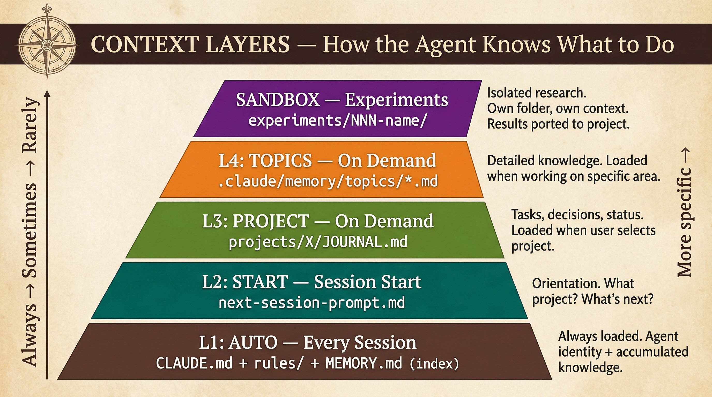
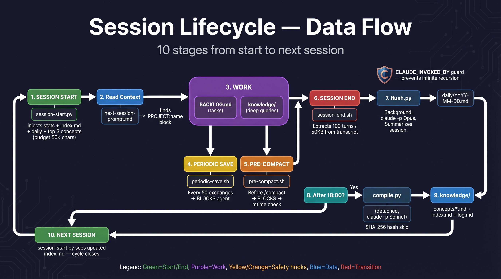

<p align="center">
  
</p>

<h2 align="center">Give Claude Code a memory that grows with your projects.</h2>

<p align="center">
  <a href="#the-problem">Problem</a> ·
  <a href="#how-to-start">Start</a> ·
  <a href="#what-you-get">What You Get</a> ·
  <a href="#how-it-works">How It Works</a> ·
  <a href="#faq">FAQ</a>
</p>

---

## The Problem

Every time you start a new chat with Claude, it forgets everything.

Your project structure. The decisions you made last week. That bug you fixed yesterday. The naming conventions your team follows. Gone.

You spend the first 10 minutes of every session catching the AI up on context it already had — and lost.

**Claude Memory Kit solves this in a 5-minute setup.**

Your agent remembers what it learned. It tracks your projects. It picks up exactly where it left off — even after the conversation compresses or you close the terminal.

---

## What You Get

### An agent that learns and remembers

Claude keeps a structured notebook (`.claude/memory/`) that persists between sessions. Patterns it discovers, decisions you make together, things that worked and things that didn't — all saved automatically and loaded next time.

The memory grows with your project. After 10 sessions, your agent knows your codebase better than a new team member.

### Multi-project tracking

Each project gets its own Journal — a single file where Claude tracks tasks, decisions, and progress. Run multiple projects in parallel. Each one has isolated context, so work on Project A never leaks into Project B.

### Context that survives compression

Long conversations get compressed by Claude Code. Without this kit, your progress disappears. With it, a **blocking hook** physically prevents compression until your agent saves. A second hook auto-checkpoints every 15 exchanges during long sessions. Nothing is lost — even if you forget to save.

### Experiment sandbox

Not sure which approach to take? The experiments folder is an isolated sandbox — each experiment gets its own folder with context, data, and prototypes. Define a question, explore options, validate, make a GO/NO-GO decision. Results get ported to your project as tasks and memory patterns.

---

## How to Start

```bash
git clone https://github.com/awrshift/claude-memory-kit.git my-project
cd my-project
claude
```

Claude handles the rest. It will ask your name, project name, and preferred language — then set everything up.

**Requirements:** [Claude Code](https://docs.anthropic.com/en/docs/claude-code/overview) + a Claude subscription or API key.

---

## How to Use (after setup)

Once set up, you interact with Claude naturally. Here are the key commands:

| What you say | What happens |
|-------------|-------------|
| "Let's work on [project name]" | Agent reads that project's Journal and picks up where you left off |
| "Create a new project [name]" | Agent creates a Journal, adds a section to the session prompt |
| "Save context" or "Update context" | Agent saves patterns to memory, updates session prompt and journal |
| "Create an experiment about [question]" | Agent creates a sandbox folder for structured research |
| "What do you remember about [topic]?" | Agent checks memory index and topic files |
| "Add a task: [description]" | Agent adds it to the active project's Journal |

**You don't need to manage files manually.** The agent handles memory, journals, and context. You just work on your project — the system learns and remembers.

**Safety nets work automatically:**
- Before context compression → agent is blocked until it saves (you'll see a brief pause)
- Every ~15 exchanges → agent checkpoints progress (you'll see a brief pause)
- Session start → agent shows you memory status, active projects, and what's next

---

## How It Works

### Five components, one system

<p align="center">
  
</p>

| Component | File | What it does |
|-----------|------|-------------|
| **Brain** | `CLAUDE.md` | Agent's identity, behavior rules, workflow instructions |
| **Memory** | `.claude/memory/` | Patterns and knowledge that persist across sessions |
| **Rules** | `.claude/rules/` | Domain-specific behavior (auto-loaded every session) |
| **Journal** | `projects/X/JOURNAL.md` | Tasks, decisions, and status for each project |
| **Context Hub** | `context/next-session-prompt.md` | "Pick up here" note between sessions |

### What loads when

Not everything loads every time. The system uses layers — heavy context only loads when needed:

<p align="center">
  
</p>

| Layer | What | When |
|-------|------|------|
| **Always on** | Brain + Rules + Memory index | Every session |
| **Session start** | "What to do next" prompt | First thing |
| **On demand** | Project journal, deep topic files | When you select a project |
| **Sandbox** | Experiment folders | When you research before building |

### The session cycle

Every session: load context, do work, save progress. Automatic hooks make sure nothing is lost — even if you forget to save.

<p align="center">
  
</p>

---

## After 10 Sessions

Here's what changes as the memory accumulates:

| Session 1 | Session 10 |
|-----------|------------|
| You explain your project from scratch | Agent already knows the codebase, conventions, and history |
| Generic suggestions | Suggestions based on what actually worked before |
| No awareness of past decisions | References previous decisions and their outcomes |
| Starts cold every time | Picks up mid-task with full context |

The kit doesn't just remember — it **learns what matters**. Verified patterns get promoted to permanent memory. One-off details stay in session notes and naturally fade.

---

## Extending with Skills

The kit focuses on memory and context. For additional capabilities, install community skills into `.claude/skills/`:

| Skill | What it does | Repo |
|-------|-------------|------|
| **Gemini** | Second opinions from Google AI | [awrshift/skill-gemini](https://github.com/awrshift/skill-gemini) |
| **Brainstorm** | Claude x Gemini structured debate | [awrshift/skill-brainstorm](https://github.com/awrshift/skill-brainstorm) |
| **AWRSHIFT** | Decision framework with evidence | [awrshift/skill-awrshift](https://github.com/awrshift/skill-awrshift) |

---

## FAQ

<details>
<summary><strong>Do I need to know how to code?</strong></summary>

No. After setup, you talk to Claude in plain language. "Read the marketing plan and draft three emails" works just as well as technical commands.
</details>

<details>
<summary><strong>Is my data private?</strong></summary>

Yes. Everything stays on your computer. Claude Code talks to Anthropic's API, which does not train on your data by default.
</details>

<details>
<summary><strong>How much does it cost?</strong></summary>

The kit is free and open source. Claude Code needs a Claude Max/Pro subscription ($20-100/mo) or Anthropic API credits (pay-per-use).
</details>

<details>
<summary><strong>Can I use this with an existing project?</strong></summary>

Yes. During setup, choose "I have existing code" and point Claude to your codebase. It will analyze the structure and set up context around it.
</details>

<details>
<summary><strong>What happens if I mess up the memory files?</strong></summary>

Everything is plain text in git. Roll back with `git checkout .claude/memory/` or just delete and let Claude rebuild from your project files.
</details>

<details>
<summary><strong>Can I run multiple projects at once?</strong></summary>

Yes. Each project gets its own Journal and context section. Multiple Claude Code windows can work on different projects simultaneously without conflicts.
</details>

---

<p align="center">
  Built by <a href="https://github.com/awrshift">Serhii Kravchenko</a> · MIT License
</p>
