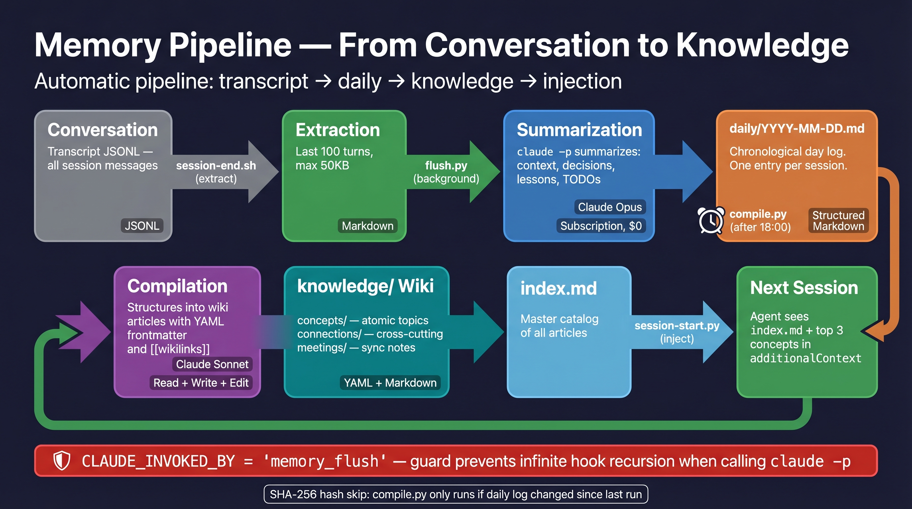

# Claude Memory Kit

**The OS layer for Claude Code. Not just memory — the entire context management lifecycle.**

[](LICENSE)
[](https://docs.anthropic.com/en/docs/claude-code/overview)
[](https://www.python.org/)
[](https://github.com/awrshift/claude-memory-kit/stargazers)

## The Problem

Every new Claude session starts from zero. Your project structure, last week's decisions, yesterday's bug fix — all gone. You waste the first 10 minutes re-explaining what Claude already knew, then lost.

**Claude Memory Kit fixes this in a 5-minute setup. Zero API cost. Runs on your existing Claude subscription.**

## Quick Start

```bash
git clone https://github.com/awrshift/claude-memory-kit.git my-project
cd my-project
claude
```

Claude handles the rest — asks your name, project name, and preferred language, then sets everything up.

> [!TIP]
> After setup, type `/tour` — Claude walks you through the system using your actual project files.

---

## What's Inside

Ten components. Five safety hooks. Five pipeline scripts. Three slash commands. One system.


| Component | File | What it does |
|-----------|------|-------------|
| **Brain** | `CLAUDE.md` | Agent identity, behavior rules, session workflow |
| **Hot Memory** | `.claude/memory/MEMORY.md` | Fast-access patterns, < 200 lines, loaded every session |
| **Deep Memory** | `.claude/memory/knowledge/` | Wiki articles with `[[wikilinks]]` — concepts, connections, meetings |
| **Hooks** | `.claude/hooks/` | 5 scripts that protect your context automatically |
| **Rules** | `.claude/rules/` | Your domain-specific conventions, auto-loaded |
| **Commands** | `.claude/commands/` | `/memory-compile`, `/memory-lint`, `/memory-query` |
| **Projects** | `projects/X/BACKLOG.md` | Per-project task queue, decisions, status |
| **Context Hub** | `context/next-session-prompt.md` | "Pick up exactly here" between sessions |
| **Daily Logs** | `daily/` | Automatic session history — you never write these |
| **Experiments** | `experiments/` | Sandbox for research before committing to a path |

Everything is plain Markdown. No database. No external services. If anything breaks, `git checkout` fixes it.

---

## How Context Loads — The Pyramid

Not everything loads at once. Light context loads every session. Heavy context loads only when needed.


| Tier | What loads | When |
|------|-----------|------|
| **L1 Auto** | CLAUDE.md + rules + MEMORY.md + SessionStart injection (wiki index + recent daily logs + top 3 concepts) | Every session — automatic |
| **L2 Start** | `next-session-prompt.md` | Session start — agent reads it first |
| **L3 Project** | `projects/X/BACKLOG.md` | When working on a specific project |
| **L4 Wiki** | `knowledge/*.md` articles | On-demand — for deep questions |
| **L5 Raw** | `daily/YYYY-MM-DD.md` | Never read directly — raw source for the pipeline |

**Why this matters:** Claude Code has a context window. If you load everything at once, you waste space on old data. The pyramid ensures Claude always has the right context at the right time — light and fast for routine work, deep and rich when it needs to remember something specific.

---

## Session Lifecycle — What Happens Automatically

Every session follows the same cycle. Hooks fire at key moments to make sure nothing gets lost.


**Start:**
1. `session-start.py` injects context — session stats, wiki catalog, recent logs, top concepts (50K char budget)
2. Agent reads `next-session-prompt.md` — finds its `<!-- PROJECT:name -->` block and knows what to do

**During work:**
3. Agent works on tasks (`BACKLOG.md`) and reads knowledge articles when needed
4. Every 50 exchanges → `periodic-save.sh` **blocks** the agent until it saves progress
5. Before context compression → `pre-compact.sh` **blocks** until memory files are updated

**End:**
6. `session-end.sh` extracts the last 100 turns from the conversation transcript
7. `flush.py` runs in the background — uses Claude to summarize the session into `daily/YYYY-MM-DD.md`
8. After 18:00 local time → automatically compiles daily logs into structured wiki articles
9. Next session starts with updated knowledge — **the cycle closes**

You don't manage any of this. It just works.

---

## Memory Pipeline — From Conversation to Knowledge

This is the most powerful part of the system. Every conversation you have gets automatically transformed into structured, searchable knowledge.



**The chain:**

| Step | What happens | Tool | Cost |
|------|-------------|------|------|
| Session ends | Hook extracts last 100 turns from transcript | `session-end.sh` | Free |
| Summarize | Claude reads the raw conversation and pulls out decisions, lessons, TODOs | `flush.py` → Claude Opus | $0 (subscription) |
| Store | Summary is appended to today's daily log | `daily/YYYY-MM-DD.md` | Free |
| Compile | After 18:00, Claude structures daily logs into wiki articles with YAML frontmatter and `[[wikilinks]]` | `compile.py` → Claude Sonnet | $0 (subscription) |
| Index | Wiki catalog is updated with new articles | `knowledge/index.md` | Free |
| Inject | Next session starts with the updated catalog already in context | `session-start.py` | Free |

**The result:** after a few weeks, you have a personal knowledge base that grows automatically. Every decision, every lesson, every pattern — indexed and searchable. No manual work required.

**Safety:** `CLAUDE_INVOKED_BY` environment variable prevents infinite recursion when pipeline scripts call `claude -p` (which would trigger hooks, which would call scripts again). SHA-256 hash comparison ensures `compile.py` only runs when daily logs actually changed.

---

## What's New in v3

- **SessionStart injection** — wiki index + recent daily logs auto-injected into every session ([Karpathy](https://karpathy.ai/)/[Cole](https://github.com/coleam00) pattern)
- **End-of-day auto-compile** — `flush.py` spawns `compile.py` after 18:00 if today's daily log has new content
- **`/memory-compile`, `/memory-lint`, `/memory-query`** — slash commands for the knowledge pipeline
- **BACKLOG.md** — single source of truth per project (tasks, decisions, status)
- **Knowledge wiki simplified** — 3 subdirs (`concepts/`, `connections/`, `meetings/`) instead of 6
- **Recursion guard** — `CLAUDE_INVOKED_BY` prevents infinite hook loops

See [CHANGELOG.md](CHANGELOG.md) for migration notes from v2.

---

## Usage

### Talk to Claude

| What you say | What happens |
|-------------|-------------|
| `/tour` | Interactive guided walkthrough using your actual files |
| `/memory-compile` | Compile daily logs into structured wiki articles |
| `/memory-lint` | Run 6 health checks on the knowledge base |
| `/memory-query "question"` | Ask the knowledge base a natural-language question |
| "Let's work on [project]" | Agent reads that project's BACKLOG.md and resumes |
| "Save context" | Agent saves patterns to memory and updates session prompt |
| "Create an experiment about [question]" | Agent creates a sandbox folder for structured research |
| "What do you remember about [topic]?" | Agent searches MEMORY.md and relevant wiki articles |

### Safety nets (automatic)

- **Before context compression** → agent is blocked until it saves (brief pause)
- **Every ~50 exchanges** → agent checkpoints progress (brief pause)
- **Session end** → background process captures conversation to `daily/`
- **Test file protection** → existing test files can't be modified (new tests allowed)

---

## Installation

### Requirements

- [Claude Code](https://docs.anthropic.com/en/docs/claude-code/overview) CLI installed
- Claude Pro/Max subscription OR API credits
- Python 3.9+ (for memory pipeline scripts, optional)

### macOS / Linux

```bash
git clone https://github.com/awrshift/claude-memory-kit.git my-project
cd my-project
claude
```

<details>
<summary>Install on Windows (WSL2)</summary>

Same commands as macOS/Linux, run inside WSL2:

```bash
git clone https://github.com/awrshift/claude-memory-kit.git my-project
cd my-project
claude
```

Native PowerShell is untested — WSL2 recommended for hook compatibility.

</details>

---

## FAQ

<details>
<summary>Do I need to know how to code?</summary>

No. After setup, you talk to Claude in plain language. "Read the marketing plan and draft three emails" works just as well as technical commands.

</details>

<details>
<summary>Is my data private?</summary>

Yes. Everything stays on your computer. Claude Code talks to Anthropic's API, which does not train on your data by default.

</details>

<details>
<summary>How much does it cost?</summary>

The kit is free and open source. Claude Code needs a Claude Max/Pro subscription or API credits. The memory pipeline uses your existing subscription — no extra cost.

</details>

<details>
<summary>Can I use this with an existing project?</summary>

Yes. During setup, choose "I have existing code" and point Claude to your codebase. It will analyze the structure and set up context around it.

</details>

<details>
<summary>What happens if I mess up the memory files?</summary>

Everything is plain text in git. Three recovery options:
1. **Roll back:** `git checkout .claude/memory/`
2. **Lint + auto-fix:** `python3 .claude/memory/scripts/lint.py --fix` — runs 6 structural checks, auto-adds missing backlinks
3. **Full rebuild:** delete the wiki and run `python3 .claude/memory/scripts/compile.py --all` to regenerate from daily log history

</details>

<details>
<summary>Do I need Obsidian?</summary>

No. The `knowledge/` wiki is plain Markdown with `[[wikilinks]]`. Works in VS Code, any text editor, or GitHub web view. Obsidian is optional — only needed for the visual graph view.

</details>

## Contributing

Issues and PRs welcome. See [CONTRIBUTING.md](CONTRIBUTING.md) for guidelines.

## License

MIT — see [LICENSE](LICENSE).
